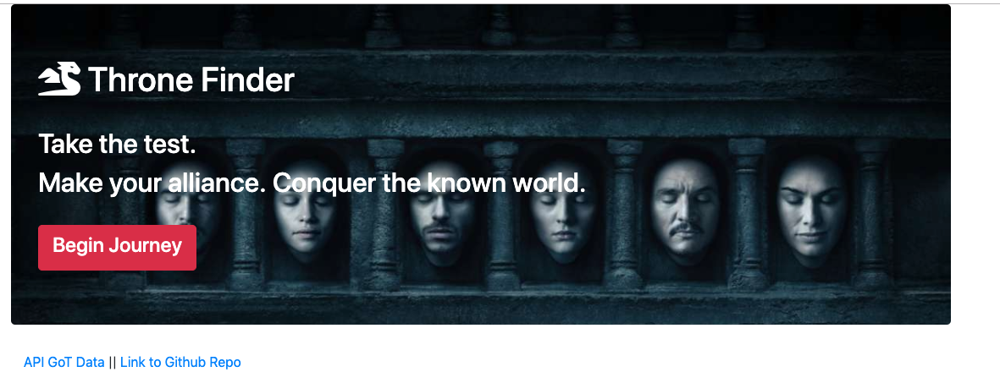
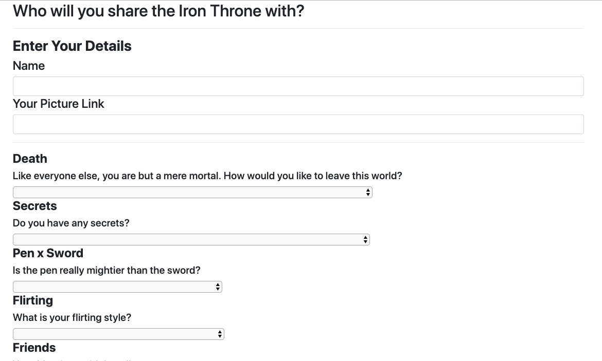
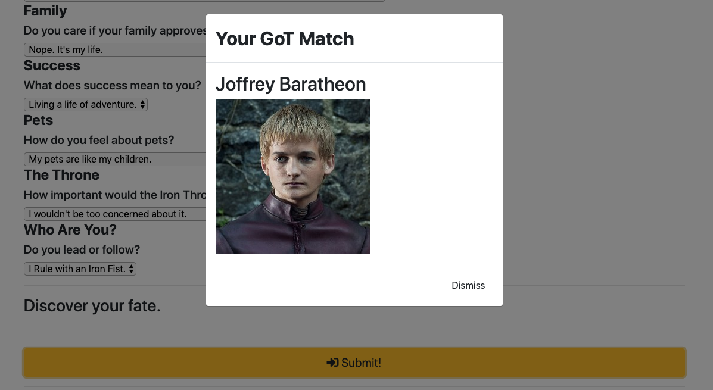
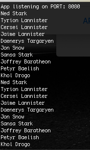
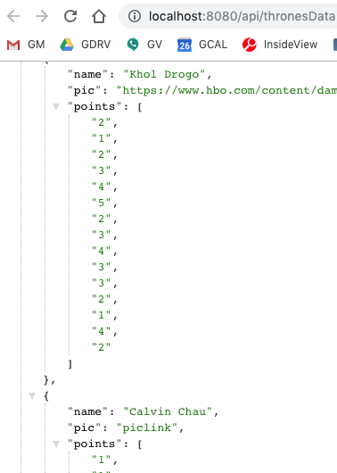

# HW11 | Throne-Finder

## Link to Live Deployed Page on Heroku
[Heroku Deployed App](https://throne-finder-app.herokuapp.com
)
## Installation 
* npm-install for initial download of dependent packages
* node server.js to init server
* navigate to localhost:8080 in web browser to init app

### Usage
* node bamazonManager.js --> run Manager Control Panel application
* node bamazonCustomer.js --> run Customer Item Purchase application

### App Screenshots
* Home Page

* Survey Page

* Match Modal popup

* Console Log for Data Object Array

* API Data

### Technologies Used
* Node.JS 
* Express
* Javascript ES6/ES5
* jQuery
* Bootstrap
* Chosen
* Font Awesome CDN

### Comments
* Added form control for missing inputs for required fields
* Chosen CDN leveraged for clean formatting of form control inputs for Survey Answers
